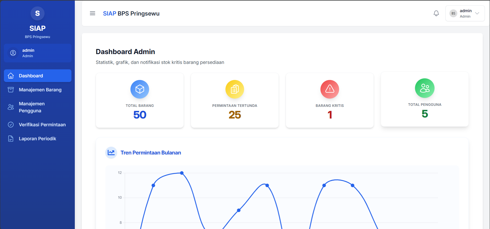
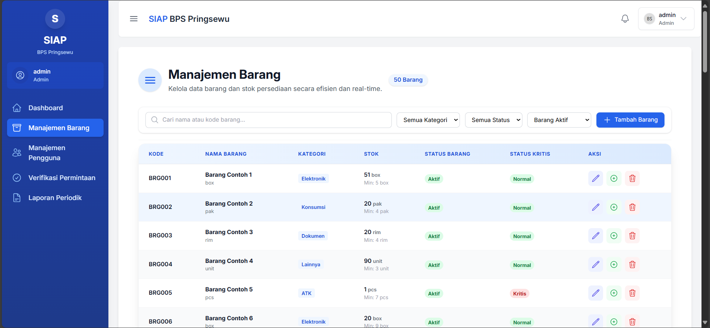
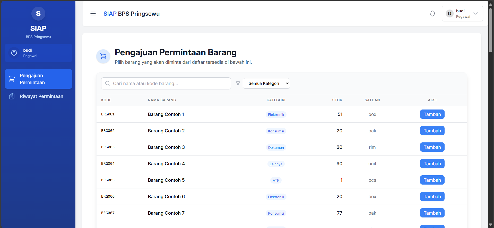
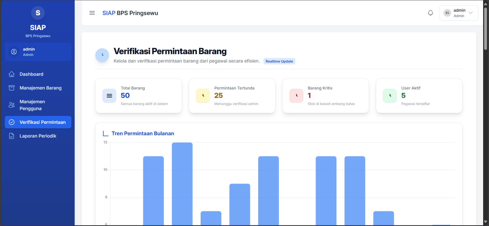
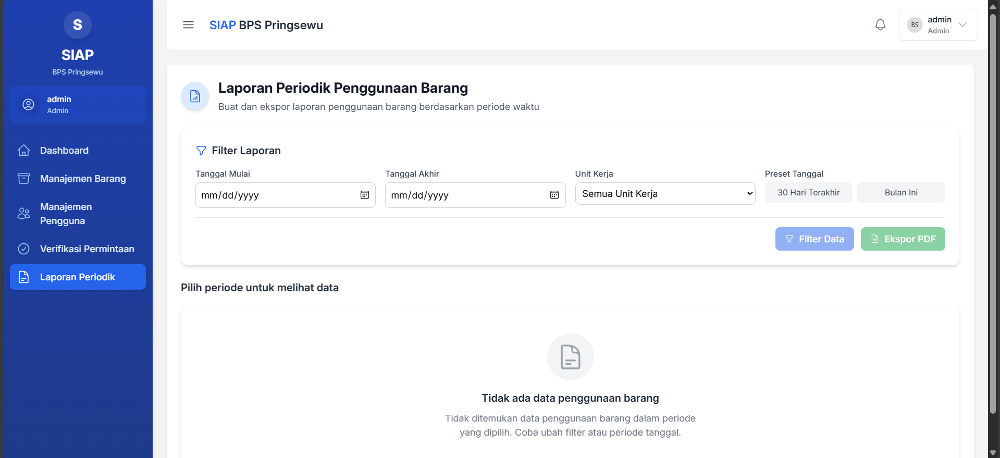

# 🚀 SIAP BPS Pringsewu

<p align="center">
  
</p>

<p align="center">
   <b>Digitalisasi Pengelolaan Aset & Persediaan untuk Efisiensi dan Transparansi</b><br>
   <a href="https://github.com/aryasetiap/siap-bps-pringsewu">GitHub</a> •
   <a href="https://pringsewukab.bps.go.id/id">BPS Pringsewu</a>
</p>

---

## Sistem Aplikasi Pengelolaan Aset & Persediaan

**SIAP BPS Pringsewu** adalah aplikasi web modern untuk digitalisasi pengelolaan barang persediaan di BPS Kabupaten Pringsewu. Dirancang untuk meningkatkan efisiensi operasional, transparansi, dan akuntabilitas dalam pengelolaan aset dan persediaan.

<p align="center">
   <a href="https://reactjs.org/"></a>
   <a href="https://nestjs.com/"></a>
   <a href="https://tailwindcss.com/"></a>
   <a href="https://typeorm.io/"></a>
   <a href="https://www.postgresql.org/"></a>
</p>

---

## 📋 Daftar Isi

- [Tentang Proyek](#tentang-proyek)
- [Fitur Unggulan](#fitur-unggulan)
- [Teknologi](#teknologi)
- [Struktur Proyek](#struktur-proyek)
- [Instalasi & Menjalankan](#instalasi--menjalankan)
- [Dokumentasi API](#dokumentasi-api)
- [Akses & Autentikasi](#akses--autentikasi)
- [Screenshots](#screenshots)
- [Kontributor](#kontributor)
- [Lisensi](#lisensi)

---

## 🔍 Tentang Proyek

Proses manual pengelolaan barang persediaan di BPS Kabupaten Pringsewu menimbulkan berbagai inefisiensi, seperti:

- Visibilitas stok tidak real-time
- Proses permintaan dan persetujuan lambat
- Akuntabilitas rendah akibat potensi kesalahan pencatatan

**SIAP** hadir sebagai solusi terintegrasi yang:

- Mengotomatisasi alur kerja permintaan dan verifikasi barang
- Meningkatkan visibilitas stok secara real-time
- Menyediakan laporan dan dokumentasi digital
- Mendukung pengambilan keputusan berbasis data

🎯 **Target:**

- Proses permintaan: ±1 hari kerja → **maksimal 15 menit**
- Potensi kesalahan pencatatan stok: **mendekati 0%**

---

## ✨ Fitur Unggulan

| Fitur                                  | Deskripsi                                                                      |
| -------------------------------------- | ------------------------------------------------------------------------------ |
| 🔐 **Autentikasi & Manajemen Akun**    | Login/logout dengan JWT, role-based access, manajemen profil & foto            |
| 📊 **Dashboard Interaktif**            | Statistik real-time, grafik tren, notifikasi stok kritis                       |
| 📦 **Manajemen Barang & Stok**         | CRUD barang, penambahan stok historis, deteksi stok kritis, pencarian & filter |
| 🛒 **Alur Permintaan Digital**         | Pengajuan multi-item, tracking status, riwayat permintaan                      |
| ✅ **Verifikasi Permintaan Fleksibel** | Review detail, persetujuan penuh/sebagian/penolakan, pengurangan stok otomatis |
| 📃 **Laporan & Dokumentasi Digital**   | Generate PDF, laporan periodik, cetak & unduh laporan                          |
| 👥 **Manajemen Pengguna**              | CRUD pengguna, aktivasi/deaktivasi akun, validasi & keamanan data              |

---

## 🛠️ Teknologi

**Frontend:**

- React.js
- Tailwind CSS
- React Router
- React Context API
- Axios
- Headless UI, Heroicons
- Chart.js + React-Chartjs-2
- React-Toastify

**Backend:**

- NestJS (Node.js)
- PostgreSQL
- TypeORM
- JWT (@nestjs/jwt)
- class-validator
- Multer (file upload)
- PDFMake (PDF generator)
- Jest, SuperTest (testing)

---

## 📁 Struktur Proyek

```text
siap-bps-pringsewu/
├── backend/                 # NestJS API
│   ├── src/                 # Source code
│   │   ├── assets/          # Gambar & font PDF
│   │   ├── auth/            # Autentikasi & role
│   │   ├── barang/          # Modul barang
│   │   ├── permintaan/      # Modul permintaan
│   │   ├── user/            # Modul pengguna
│   │   └── ...
│   ├── ENDPOINT_API.md      # Dokumentasi API
│   └── README.md            # Dokumentasi backend
│
├── frontend/                # React.js SPA
│   ├── public/              # Asset publik
│   ├── src/                 # Source code
│   │   ├── components/      # Komponen UI
│   │   ├── context/         # React Context
│   │   ├── pages/           # Halaman aplikasi
│   │   ├── services/        # Service API
│   │   └── ...
│   └── README.md            # Dokumentasi frontend
│
├── SDLC_SIAP.md             # Dokumen SDLC
├── TASK_MANAGEMENT.md       # Manajemen tugas
└── README.md                # Dokumentasi utama (file ini)
```

---

## 🚦 Instalasi & Menjalankan

### Prasyarat

- Node.js (v16+)
- PostgreSQL (v13+)
- Git

### Backend

```bash
# Clone repository & masuk ke folder backend
git clone https://github.com/aryasetiap/siap-bps-pringsewu.git
cd siap-bps-pringsewu/backend

# Install dependencies
npm install

# Konfigurasi environment
cp .env.example .env
# Edit .env sesuai kebutuhan

# Setup database & seed data awal
npm run migration:run
npm run seed

# Jalankan server backend
npm run start:dev
# Backend: http://localhost:3001
```

### Frontend

```bash
cd ../frontend

# Install dependencies
npm install

# Konfigurasi environment
cp .env.example .env
# Edit .env sesuai kebutuhan

# Jalankan server frontend
npm start
# Frontend: http://localhost:3000
```

---

## 📚 Dokumentasi API

Dokumentasi lengkap tersedia di [backend/ENDPOINT_API.md](backend/ENDPOINT_API.md).

**Endpoint Utama:**

- **Autentikasi**
  - `POST /api/auth/login` - Login
  - `POST /api/auth/logout` - Logout
- **Pengguna**
  - `POST /api/user` - Buat user baru (admin)
  - `GET /api/user` - List user (admin)
  - `GET /api/user/profile` - Profil user login
- **Barang**
  - `GET /api/barang` - List barang
  - `PATCH /api/barang/:id/add-stok` - Tambah stok (admin)
  - `GET /api/barang/stok-kritis` - Barang kritis
- **Permintaan**
  - `POST /api/permintaan` - Ajukan permintaan (pegawai)
  - `GET /api/permintaan/:id/pdf` - Bukti PDF
  - `PATCH /api/permintaan/:id/verifikasi` - Verifikasi (admin)

---

## 🔑 Akses & Autentikasi

Aplikasi menggunakan **JWT Authentication** dengan role-based access.

| Role    | Username  | Password     | Akses Fitur                                          |
| ------- | --------- | ------------ | ---------------------------------------------------- |
| Admin   | `admin`   | `admin123`   | Semua fitur (dashboard, barang, verifikasi, laporan) |
| Pegawai | `pegawai` | `pegawai123` | Permintaan barang, riwayat, profil                   |

Token JWT disimpan di localStorage dan dikirim via Authorization header untuk setiap request API.

---

## 📸 Screenshots

| Dashboard Admin                         | Manajemen Barang                                    | Form Permintaan                                   | Verifikasi Permintaan                                         | Laporan Periodik                                    |
| --------------------------------------- | --------------------------------------------------- | ------------------------------------------------- | ------------------------------------------------------------- | --------------------------------------------------- |
|  |  |  |  |  |

---

## 👨‍💻 Kontributor

**Arya Setia Pratama**  
[GitHub: aryasetiap](https://github.com/aryasetiap)  
WhatsApp: 085669644533

---

## 📝 Lisensi

Proyek ini dilindungi hak cipta © 2025 BPS Kabupaten Pringsewu.  
Hak cipta dilindungi undang-undang.

---
